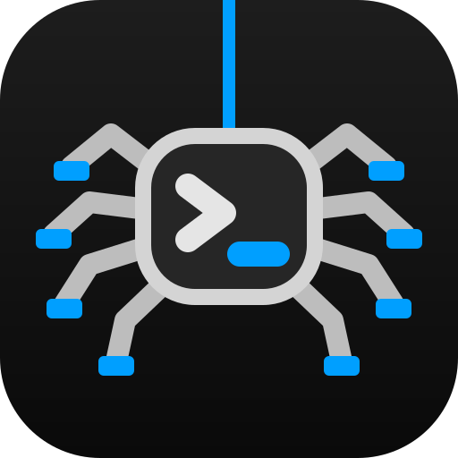

<p align="center">
  
</p>

<h1 align="center">Telar</h1>

<p align="center">
  A terminal for working with coding agents.<br>
  Persistent sessions, agent status and remote machines in one native window.
</p>

<p align="center">
  <a href="#about">About</a> ·
  <a href="#getting-started">Getting started</a> ·
  <a href="#documentation">Documentation</a> ·
  <a href="#contributing">Contributing</a>
</p>

## About

Telar is a terminal emulator and multiplexer for macOS and Linux. It brings
shells, editors and coding agents into workspaces, tabs and split panes, with
a sidebar that shows which agents are working, waiting for input or finished.


A workspace with a coding agent, Neovim and a shell. The sidebar keeps agent
activity visible across tasks. [Explore workspaces and panes](docs/usage.md#workspaces-tabs-and-panes).

When several agents are running, finding the one that needs you becomes part
of the work. Telar keeps their status beside your terminals and lets you
organize tasks in Git worktrees, follow their progress and return to their
results. Your agents keep their own interfaces; Telar runs their existing CLIs.

The window connects to a separate runtime that owns the processes and their
terminals. Close the window and the work keeps running. Reopen it to reconnect,
or connect over SSH to a runtime on another machine.

Telar is written in Zig and uses Ghostty's terminal emulation library,
`libghostty-vt`, with its own window and multiplexer. The name is Spanish for
*loom*.

## What you can do

- **Keep track of agents.** Integrations for Claude Code, Codex, Pi, Cursor
  Agent and OpenCode report lifecycle events. Without an integration, Telar
  uses process and terminal observations to estimate status.
- **Give tasks their own workspaces.** Create a Git worktree, launch an agent
  there and inspect its status and diff through the CLI. Keep your shell,
  editor and tests alongside it.
- **Work across machines.** Save SSH hosts and switch between their workspaces
  in the same window. Processes stay on the machine running their runtime
  when the client disconnects.
- **Find previous commands.** Search shell and agent command history by
  workspace, directory, pane or exit status, with captured output where
  available.
- **Make the terminal yours.** Configure themes, fonts, keybindings and the
  sidebar in Lua. Add behavior through plugins and display terminal images
  with Kitty graphics support.

## Getting started

Telar is in early development. There are no published releases yet; build
from source to try it. Configuration and CLI interfaces are still evolving.

| Platform | Desktop requirements |
| --- | --- |
| macOS | macOS 26 or later and a [Metal 4 GPU](docs/flows/metal4-renderer.md) |
| Linux | Wayland and Vulkan 1.3 with the [required extensions](docs/flows/vulkan-renderer.md) |

Install **Zig 0.16.0**, **Rust/Cargo 1.93.1 or newer**, and the
[platform build dependencies](docs/development.md#build-requirements), then:

```sh
git clone https://github.com/adriangs1996/telar.git
cd telar
zig build -Doptimize=ReleaseFast
./zig-out/bin/telar
```

Telar opens a window with your shell and starts its local runtime when needed.
Run your editor or agent as you would in another terminal.

The default keybinding prefix is `Ctrl+b`: press it, release it, then press
the next key.

| Keys after `Ctrl+b` | Action |
| --- | --- |
| `%` / `"` | Split left/right or top/bottom |
| `c` | Create a tab |
| `n` / `p` | Select the next or previous tab |
| `s` | Toggle the sidebar |
| `/` | Search command history |

For a macOS application bundle, a Linux desktop installation or a server build
without a GUI, see [local installation](docs/packaging.md#install-a-local-build).

### Connect your agents

Install the integration for the agent you use, then start a new agent session
inside Telar. For Claude Code, from the checkout:

```sh
./zig-out/bin/telar integration install claude
```

The other integration names are `codex`, `pi`, `cursor` and `opencode`.
Integrations install hooks or extensions in the agent's configuration and
report its activity to Telar. Run Codex with `codex --no-daemon` so its session
and hooks belong to its pane. See [working with agents](docs/agents.md)
for details.

The binary includes guidance for agents using Telar:

```sh
./zig-out/bin/telar --skill
```

### Connect to another machine

Install matching Telar builds on both machines, with `telar` available to the
remote SSH command, then open a window connected to that host:

```sh
./zig-out/bin/telar gui --remote dev@box
```

You can also [save machines](docs/remote.md#save-a-machine) for repeated use.
See [remote connections](docs/remote.md) for setup and reconnection
behavior.

## Find actions and previous commands

### Command palette

Find an action by name, navigate to a workspace or switch machines from the
command palette. Open it with `Ctrl+b`, then `g`; select **Actions** to search
for commands such as splitting or focusing a pane.
[Learn the palette controls](docs/usage.md#find-an-action).


The screenshots use a [custom configuration](docs/configuration.md); the
instructions here use the default shortcuts.

### Searchable history

Find commands from your shells and agents, filter by where they ran, and inspect
their recorded details. Paste a command to edit it or run it again.
[Search and reuse commands](docs/usage.md#find-previous-commands) with `Ctrl+b`,
then `/`.


## Documentation

Start with the [user guide](docs/README.md) or choose a task below.

| Topic | Guide |
| --- | --- |
| Themes, fonts, keybindings and profiles | [Configuration](docs/configuration.md#start-with-a-small-config) |
| Agent control and worktrees | [Working with agents](docs/agents.md) |
| Command history | [Search and reuse commands](docs/usage.md#find-previous-commands) |
| Extensions and editor navigation | [Plugins](docs/plugins.md#try-the-example-plugin) · [Neovim integration](integrations/nvim/README.md) |
| Terminal images | [Kitty graphics](docs/kitty-graphics.md#display-an-image) |
| Optional network inspection | [TLS proxy and capture](docs/proxy-tls.md#try-the-proxy) |

Run `telar --help` for the CLI command overview.
[Using Telar](docs/usage.md) covers navigation, session lifetime and troubleshooting.

## Contributing

Bug reports and contributions are welcome. For a bug, include your OS, Telar
version or commit, reproduction steps and whether the runtime is local or
remote. File reports in [GitHub Issues](https://github.com/adriangs1996/telar/issues).

Start with the [development guide](docs/development.md) for dependencies,
tests, diagnostics and benchmarks. Read the [architecture](docs/architecture.md)
and relevant [invariants](docs/invariants.md) before changing runtime or client
behavior.

## Acknowledgements

[Ghostty](https://github.com/ghostty-org/ghostty) provides the terminal emulation
library at Telar's core. [herdr](https://github.com/herdrdev/herdr) inspired the
project, and [T3 Code](https://github.com/pingdotgg/t3code) informed its sidebar.

## License

Telar is available under the [MIT license](LICENSE).
