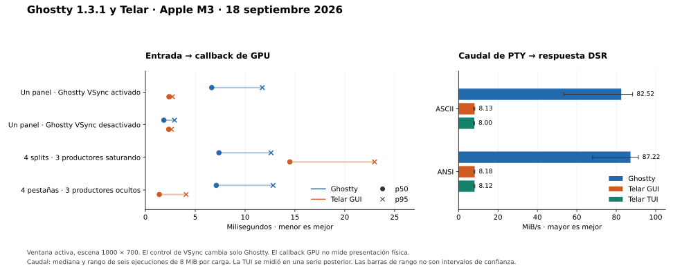

# Ghostty frente a Telar

El [diagnóstico posterior del cuello de botella](bottleneck.md) localiza una
copia de 2,7 MB en el runtime y valida su efecto con una comparación A/B.
La [primera optimización aplicada](phase1.md) eleva la GUI a **60,00 MiB/s ASCII y 55,71 MiB/s ANSI**.
La [segunda optimización](phase2.md) alcanza **84,81 y 78,59 MiB/s** con texto
repetido, y **79,15 y 72,53 MiB/s** con texto variable. También registra una
regresión de latencia bajo carga: +3,82 ms de p95 por ronda en splits y
+1,89 ms en pestañas. El informe conserva ese coste y todas las observaciones.
La [tercera optimización](phase3.md) reduce el p95 por ronda en **3,21 ms en
splits** y **5,09 ms en pestañas** frente a la fase 2, y cumple el margen de
conservación del caudal del 5% en los cuatro casos de GUI con cargas de 64 MiB.
La ráfaga corta de ASCII variable y ANSI variable en TUI siguen inconclusos.
Los resultados originales de este informe conservan el binario anterior.

Medición local del 18 de septiembre de 2026, con las ventanas de prueba en
primer plano. El resultado depende de la carga y de la política de dibujo:

- Con un panel y el VSync predeterminado de Ghostty, las medianas fueron
  **6,65 ms en Ghostty, 2,36 ms en Telar GUI y 6,82 ms en Telar TUI**.
- Desactivando VSync **solo en Ghostty**, su mediana bajó a **1,85 ms**;
  Telar GUI, sin cambios, midió **2,33 ms**.
- Con otros tres splits escribiendo continuamente, Ghostty midió **7,38 ms**
  y Telar GUI **14,49 ms** de mediana.
- En salida masiva, Ghostty procesó unos **83–87 MiB/s**, frente a unos
  **8 MiB/s en Telar**, hasta recibir la respuesta del emulador.

Son resultados de estos recorridos instrumentados en esta máquina. No hay una
clasificación única de rendimiento, ni estas diferencias aíslan el coste del
socket Unix. La latencia termina en un callback de GPU, no cuando se ilumina
el píxel del monitor.



## Latencia con la configuración principal

Ghostty usa `window-vsync=true`, fijado explícitamente y coincidente con su
[valor predeterminado en 1.3.1](https://github.com/ghostty-org/ghostty/blob/v1.3.1/src/config/Config.zig#L1903-L1916).
La TUI se ejecuta dentro de Ghostty con el mismo ajuste.

Un panel: seis rondas, 200 muestras medidas por aplicación y ronda. Layouts:
cuatro rondas, 100 muestras por aplicación y caso. Cada ejecución descarta
otras 20 respuestas iniciales de calentamiento.

| Caso | Aplicación | Muestras | p50 | p95 | p99 |
| --- | --- | ---: | ---: | ---: | ---: |
| Un panel | Ghostty | 1.200 | 6,65 ms | 11,74 ms | 14,61 ms |
| Un panel | Telar GUI | 1.200 | 2,36 ms | 2,71 ms | 6,41 ms |
| Un panel | Telar TUI + Ghostty | 1.200 | 6,82 ms | 13,90 ms | 17,05 ms |
| Cuatro splits, sin salida de fondo | Ghostty | 400 | 7,05 ms | 12,50 ms | 14,00 ms |
| Cuatro splits, sin salida de fondo | Telar GUI | 400 | 2,47 ms | 3,25 ms | 16,85 ms |
| Cuatro pestañas, sin salida de fondo | Ghostty | 400 | 6,80 ms | 12,49 ms | 16,05 ms |
| Cuatro pestañas, sin salida de fondo | Telar GUI | 400 | 2,40 ms | 2,72 ms | 7,39 ms |
| Cuatro splits, tres con salida continua | Ghostty | 400 | 7,38 ms | 12,61 ms | 13,45 ms |
| Cuatro splits, tres con salida continua | Telar GUI | 400 | 14,49 ms | 22,99 ms | 26,13 ms |
| Cuatro pestañas, tres ocultas con salida continua | Ghostty | 400 | 7,11 ms | 12,81 ms | 16,08 ms |
| Cuatro pestañas, tres ocultas con salida continua | Telar GUI | 400 | 1,39 ms | 4,08 ms | 7,78 ms |

Son percentiles de las muestras agrupadas después del calentamiento. La ventaja
de la mediana de GUI sin carga no se extiende a todos los extremos: en splits
sin salida de fondo su p99 fue mayor, y su máximo fue mayor que el de Ghostty
en todos los casos nativos. Los máximos y las medianas de cada ronda están en
el [resumen completo](results/main/summary.md).

Los casos con carga ejecutan tres productores sin limitador. Intentan saturar
sus PTY, pero **no imponen el mismo caudal consumido** a cada aplicación. Los
contadores `emitted_bytes` de los receipts son snapshots y pueden quedar
desactualizados al terminar el proceso; no se usan para comparar ese caudal.
El resultado de pestañas ocultas tampoco permite explicar por sí solo por qué
la mediana de GUI fue menor que sin salida de fondo.

### Diferencias entre rondas

Delta = Telar menos Ghostty: positivo significa más latencia de Telar. Se
calcula el percentil dentro de cada ejecución y luego la media de las
diferencias entre rondas emparejadas. Por tanto, estos deltas **no son la resta
de los percentiles agrupados de la tabla anterior**.

| Caso y comparación | Delta p50 | IC 95% | Delta p95 | IC 95% |
| --- | ---: | --- | ---: | --- |
| Un panel, GUI − Ghostty | −4,301 ms | [−4,363; −4,257] | −9,159 ms | [−9,813; −8,663] |
| Un panel, TUI − Ghostty | +0,436 ms | [+0,187; +0,702] | +1,882 ms | [+1,218; +2,378] |
| Splits sin salida, GUI − Ghostty | −4,610 ms | [−4,752; −4,435] | −8,210 ms | [−9,386; −6,999] |
| Pestañas sin salida, GUI − Ghostty | −4,645 ms | [−5,008; −4,307] | −9,429 ms | [−9,788; −9,085] |
| Splits con salida, GUI − Ghostty | +7,032 ms | [+6,455; +7,744] | +10,692 ms | [+9,334; +12,050] |
| Pestañas con salida, GUI − Ghostty | −5,726 ms | [−6,144; −5,307] | −9,770 ms | [−11,832; −6,886] |

Los IC usan 10.000 remuestreos de rondas emparejadas completas, semilla
20260918 e intervalo de percentiles. La unidad de remuestreo es la ronda,
no cada pulsación. Cuatro o seis rondas limitan la precisión; los intervalos
describen la variación observada y no corrigen diferencias entre máquinas o
instrumentaciones. No se estima un IC para p99. Los cocientes geométricos y
los deltas de cada ronda quedan en [summary.json](results/main/summary.json).

## Control de VSync

Cuatro rondas adicionales de 100 muestras por aplicación, con 20 respuestas
de calentamiento. **Solo Ghostty cambia a `window-vsync=false`; Telar GUI
mantiene exactamente la misma configuración.**

| Aplicación | p50 | p95 | p99 |
| --- | ---: | ---: | ---: |
| Ghostty, VSync desactivado | 1,85 ms | 2,92 ms | 8,60 ms |
| Telar GUI, sin cambios | 2,33 ms | 2,62 ms | 16,43 ms |

La diferencia media entre medianas por ronda, GUI menos Ghostty, fue
**+0,458 ms**, IC 95% **[+0,396; +0,521] ms**. Para p95 fue −0,994 ms,
IC **[−3,631; +0,551] ms**: este último intervalo no establece una dirección.
[Datos](raw/controlled-nosync.json) y [estadísticas](results/vsync-off/summary.md).

En Ghostty 1.3.1, VSync crea un DisplayLink; mientras está activo, los cambios
de contenido no dibujan hasta recibir su señal. Al desactivarlo, el dibujo
puede ejecutarse al llegar los datos. Perder el foco también detiene ese
DisplayLink. Véanse [generic.zig](https://github.com/ghostty-org/ghostty/blob/v1.3.1/src/renderer/generic.zig#L632-L637),
[Thread.zig](https://github.com/ghostty-org/ghostty/blob/v1.3.1/src/renderer/Thread.zig#L453-L467)
y [setFocus](https://github.com/ghostty-org/ghostty/blob/v1.3.1/src/renderer/generic.zig#L942-L958).

Telar intenta dibujar inmediatamente cuando está disponible su presupuesto de
1/60 s; su DisplayLink despierta el trabajo pendiente y su CAMetalLayer conserva
la sincronización de presentación. Esto consta en la
[fuente congelada de TelarView.m](https://github.com/adriangs1996/telar/blob/bf6e130c9ac81274c405847c6baf20dd3a242382/src/gui/macos/TelarView.m#L150-L194)
y en su [configuración de capa](https://github.com/adriangs1996/telar/blob/bf6e130c9ac81274c405847c6baf20dd3a242382/src/gui/macos/TelarView.m#L67-L84).

El control y el código respaldan que la política de frames influye mucho en
esta prueba de entradas espaciadas. El control se ejecutó después de la serie
principal, con una nueva referencia de GUI; no fue una alternancia aleatoria
entre VSync activado y desactivado. La diferencia residual tampoco aísla el
socket, y no debe extrapolarse a presentación física o eficiencia energética.

## Caudal de salida

Cada ejecución escribe 8 MiB de ASCII y después 8 MiB con secuencias ANSI.
El reloj empieza antes del primer bloque y termina con la respuesta DSR a una
consulta enviada después de todo el payload. Se consume otra respuesta DSR
antes de empezar. El endpoint confirma procesamiento ordenado del flujo,
sin exigir que se hayan presentado todos sus frames. No mide el parser aislado.

Ghostty y GUI se alternaron en seis rondas emparejadas. La TUI se midió en
**seis ejecuciones posteriores y separadas**, sin emparejarlas estadísticamente
con las nativas. En total son 18 ejecuciones, 36 casos de 8 MiB: **288 MiB**.

| Aplicación | ASCII, mediana [rango] | ANSI, mediana [rango] |
| --- | ---: | ---: |
| Ghostty | 82,52 [53,41–88,30] MiB/s | 87,22 [67,95–91,23] MiB/s |
| Telar GUI | 8,13 [7,58–8,27] MiB/s | 8,18 [7,82–8,26] MiB/s |
| Telar TUI + Ghostty, serie posterior | 8,00 [7,56–8,09] MiB/s | 8,12 [7,78–8,27] MiB/s |

La relación entre medianas de caudal de Ghostty y GUI fue aproximadamente
**10,1× en ASCII y 10,7× en ANSI**. Es una comparación de este workload completo,
con emulación, planificación y trabajo concurrente de la aplicación. La
similitud de GUI y TUI apunta a investigar su ruta común de runtime, PTY y VT;
no demuestra qué parte limita el caudal ni permite culpar al socket Unix.
En Telar, el runtime genera la respuesta DSR y la devuelve por la PTY sin
exigir una ida y vuelta al cliente. La publicación de frames y el trabajo del
cliente pueden competir por recursos e influir en el tiempo; no están aislados.

Los bloques son de 64 KiB y las líneas de 64 bytes no envuelven con los anchos
probados. ASCII y ANSI tienen igual cantidad de bytes, pero distinto trabajo
de texto y atributos. ANSI corre con scrollback ya poblado por ASCII: se
compara cada carga entre productos, no las dos cargas entre sí. Ambos usan un
límite predeterminado de scrollback de 10.000.000 bytes.

Antes de medir se espera la geometría final de la PTY y la localización del
marcador en la textura de 1000×700. Cada caso guarda columnas y filas, y falla
si cambian. Todos los logs aceptados localizaron el marcador antes del
handshake. El readback instrumentado sigue activo durante la carga.

Las 20 respuestas de calentamiento y una respuesta adicional después del
caudal solo verifican el recorrido interactivo: **no se incluyen en los
resultados de latencia de este informe**. Datos y estadísticas de
[caudal nativo](raw/controlled-throughput.json),
[su resumen JSON](results/throughput-native/summary.json),
[caudal TUI](raw/controlled-throughput-tui.json) y
[su resumen JSON](results/throughput-tui/summary.json).

## Frontera de medida y controles

La sonda despacha `keyDown` con `x` al responder nativo del panel principal.
Un proceso Python con la PTY en modo raw alterna el color de una celda. La
latencia termina al entrar en el callback de GPU de una operación completada
cuyo píxel contiene el color esperado. Hay una única entrada pendiente y
cada frame aceptado debe corresponder a su secuencia y color.

El recorrido incluye entrada, PTY, emulación, preparación, GPU y entrega del
callback. En Telar incluye runtime y cliente; en la TUI también incluye el
Ghostty que la aloja. No mide teclado físico, compositor, barrido del monitor
ni luz emitida. Ghostty actualiza su capa después de completar el trabajo de
GPU; el callback no confirma esa presentación. Referencias:
[Frame.zig](https://github.com/ghostty-org/ghostty/blob/v1.3.1/src/renderer/metal/Frame.zig#L63-L84)
e [IOSurfaceLayer.zig](https://github.com/ghostty-org/ghostty/blob/v1.3.1/src/renderer/metal/IOSurfaceLayer.zig#L44-L69).

Ghostty tiene una cola Metal por renderer de panel. La sonda identifica la
que produce el marcador y descarta las demás. Telar GUI compone los paneles
en una escena. La lectura añade un píxel al trabajo de renderizado, pero los
costes de instrumentación no son idénticos: Metal 4 añade residencia y una
barrera; Ghostty usa un blit clásico. El timestamp incluye la demora CPU del
callback, no es un timestamp puro de finalización del hardware.

- Se exige medio segundo de foco estable antes del ensayo. Las cuatro series
  de comprobaciones de aplicación activa y ventana con foco, al enviar y al
  aceptar cada respuesta, son verdaderas en todas las ejecuciones aceptadas.
- Se programan pausas deterministas de 25–74 ms tras la respuesta anterior.
  No entran en el tiempo medido. Esto ensaya respuestas a entradas espaciadas,
  no velocidad máxima de escritura de teclas ni creación de splits o pestañas.
- Las seis rondas con tres aplicaciones recorren las seis permutaciones de
  orden. Los layouts y el control nativo alternan AB/BA/BA/AB; el caudal nativo
  equilibra tres rondas de cada orden. Los casos de layouts siguen el mismo
  orden dentro de cada ronda.
- AeroSpace pone en modo flotante solo las ventanas temporales. Ghostty usa
  una copia privada firmada; Telar tiene socket, historial, datos y configuración
  aislados por ejecución. Se conserva toda muestra posterior al calentamiento.
- No hubo compilaciones ni otros benchmarks en paralelo a las mediciones.
  Los procesos habituales del escritorio siguieron funcionando.

Son **7.600 muestras de latencia medidas**: 3.600 de un panel, 3.200 de layouts
y 800 del control de VSync. Las muestras del ensayo exploratorio previo no se
mezclan con estas series.

### Geometría

Escena final de 1000×700 píxeles, JetBrains Mono a tamaño nominal 15, padding
cero y sidebar de Telar oculto. Las áreas útiles difieren por barras y métricas.

| Caso | Ghostty, PTY principal | Telar GUI, PTY principal | Telar TUI, PTY principal |
| --- | --- | --- | --- |
| Un panel y caudal | 111×35 | 111×31 | 111×33 |
| Cuatro splits | 55×35 | 53×29 | No medido |
| Cuatro pestañas | 111×36 | 111×31 | No medido |

Los splits se crean hacia la derecha, con proporciones aproximadas 1/2, 1/4,
1/8 y 1/8. Ghostty usa targets de 499×700, 249×700 y dos de 125×700; Telar
compone todo en 1000×700. En pestañas se vuelve a la primera. Las pestañas
ocultas de Ghostty tenían 35 o 36 filas; las geometrías individuales quedan
en los receipts. La igualdad de escena no implica igualdad de celdas.

## Entorno y trazabilidad

Apple M3, 16 GiB de RAM, macOS 26.6.2 build 25G83, conectado a corriente.
La pantalla declara una frecuencia máxima de 100 Hz; no se midió la frecuencia
efectiva de presentación. Ghostty 1.3.1 estable usa ReleaseFast y Zig 0.15.2.
Telar se compiló con Zig 0.16.0 y `-Doptimize=ReleaseFast`, sin trazas de producción.

El binario de Telar procede de una copia congelada de `bf6e130c`, más el
[parche conservado](source.patch); las ediciones posteriores del workspace
no entran en él. Telar usa `libghostty-vt` de `a4edca2a`, identificado como
1.3.2-dev: comparten familia de emulador, con revisiones distintas.
[Compilación y hash del binario](build.json), [configuración](config.lua) y
[dependencia fijada](https://github.com/adriangs1996/telar/blob/bf6e130c9ac81274c405847c6baf20dd3a242382/build.zig.zon#L25-L28).

El hash de Ghostty en los manifiestos corresponde al ejecutable instalado.
Los hashes de las copias privadas después de firmarlas, las versiones de
Python y clang, y su limpieza final están en
[toolchain-and-private-apps.json](raw/toolchain-and-private-apps.json).

El usuario dejó libres las ventanas durante las series finales. Eso no hizo
del equipo un laboratorio en reposo: la
[captura anterior al single](raw/processes-before-controlled-single.txt)
registró un `next-server` de otro proyecto con 140,2% de CPU.

Los presupuestos de entrada interactiva, medios y observación del proyecto
siguen siendo distintos. Estas mediciones evalúan la respuesta interactiva y
el consumo de salida masiva con la aplicación funcionando; no aíslan esos
presupuestos. `host_*` incluye arranque y calentamiento del proceso instrumentado
y no suma todo el árbol de Telar. Asignaciones, bytes de IPC, ocupación de colas,
trabajo descartado y memoria retenida del sistema completo no se midieron.
Es una limitación de alcance respecto a
[engineering-invariants.md](../../engineering-invariants.md), y no permite
afirmar mejoras de CPU, memoria o eficiencia global.

### Incidencias de la sonda

Una ejecución de splits con carga completó sus 120 respuestas y luego un
secundario registró `PTY write made no progress`. El receipt se escribió
29,23 ms después del resultado exitoso, compatible con el cierre de ventana
que la sonda solicita después de guardarlo.
Se conservaron las 100 muestras medidas y el error original, con
`post_measurement_cleanup_error`. Se corrigió el tratamiento de una escritura
de cero bytes como `EPIPE`; solo se acepta como cierre normal si ya existe un
resultado exitoso. [Continuación de layouts](raw/layout-continuation.json).

La serie de caudal nativo se reanudó tras dos fallos anteriores al handshake:
una escritura JSON reentrante por `SIGWINCH` y un marcador que conservaba las
dimensiones de la ventana previas al resize. Ninguno produjo datos de caudal.
Las correcciones aplazan `SIGWINCH` durante el reemplazo atómico y actualizan
el marcador durante el setup. Las muestras completas anteriores se conservaron;
cada continuación registra los nuevos hashes de fixture o sonda por ejecución.
Véanse [incidencia atómica](raw/throughput-atomic-continuation.json),
[incidencia de geometría](raw/throughput-geometry-continuation.json) y los
scripts de [reanudación atómica](raw/resume-throughput-atomic.py) y
[reanudación de geometría](raw/resume-throughput-geometry.py).

Los JSON conservan manifiestos, hashes, rondas, muestras y geometrías:
[single](raw/controlled-single.json), [layouts](raw/controlled-layouts.json),
[control de VSync](raw/controlled-nosync.json),
[caudal nativo](raw/controlled-throughput.json) y
[caudal TUI](raw/controlled-throughput-tui.json).
Las versiones del harness también se conservan como
[latencia inicial](raw/controlled-latency-instrumentation.tar.gz),
[corrección de cierre](raw/closure-instrumentation.tar.gz),
[escritura atómica](raw/atomic-instrumentation.tar.gz) y
[versión final](raw/current-instrumentation.tar.gz), con sus
[hashes finales](raw/current-instrumentation-sha256.json).
El [apéndice exploratorio](exploratory.md) conserva la primera serie sin control
de foco y los intentos previos; no se usan en las tablas principales.

Validación completada: compilación de la sonda con clang, `py_compile` de las
herramientas Python, `git diff --check` y reproducción de los resúmenes desde
los JSON conservados. Se verificaron también foco, geometría, conteos y hashes.

## Reproducción

Herramientas: [runner](../../../tools/gui_tui_latency.py),
[sonda nativa](../../../tools/gui_tui_latency.m),
[fixture](../../../tools/terminal_bench_fixture.py) y
[análisis](../../../tools/terminal_bench_report.py).
Ejecutar secuencialmente, dejando libres las ventanas de prueba:

```sh
zig build -Doptimize=ReleaseFast --prefix /tmp/telar-release

python3 tools/gui_tui_latency.py /tmp/telar-release/bin/telar /tmp/bench-single \
  --mode all --cases single --samples 200 --rounds 6 \
  --viewport 1000 700 --float-windows

python3 tools/gui_tui_latency.py /tmp/telar-release/bin/telar /tmp/bench-layouts \
  --mode native --cases splits tabs splits-load tabs-load --samples 100 --rounds 4 \
  --viewport 1000 700 --float-windows

python3 tools/gui_tui_latency.py /tmp/telar-release/bin/telar /tmp/bench-nosync \
  --mode native --cases single --vsync false --samples 100 --rounds 4 \
  --viewport 1000 700 --float-windows

python3 tools/gui_tui_latency.py /tmp/telar-release/bin/telar /tmp/bench-throughput \
  --mode native --cases single --throughput --samples 1 --rounds 6 \
  --viewport 1000 700 --float-windows

python3 tools/gui_tui_latency.py /tmp/telar-release/bin/telar /tmp/bench-throughput-tui \
  --mode tui --cases single --throughput --samples 1 --rounds 6 \
  --viewport 1000 700 --float-windows

python3 tools/terminal_bench_report.py /tmp/bench-single/comparison.json \
  /tmp/bench-layouts/comparison.json --output /tmp/bench-report
python3 tools/terminal_bench_report.py /tmp/bench-nosync/comparison.json \
  --output /tmp/bench-nosync-report
```

Generar los resúmenes después de terminar las mediciones. Los ensayos de
caudal se resumen por separado; sus respuestas interactivas de comprobación
no son un benchmark de latencia. `--float-windows` requiere AeroSpace y solo
afecta a ventanas temporales; sin ese gestor puede omitirse. `--source` indica
el checkout usado para compilar un binario externo. La sonda necesita macOS
con las APIs Metal y Metal 4 utilizadas. Para reconstruir exactamente esta
medición, usar el commit y el parche registrados en `build.json`.
