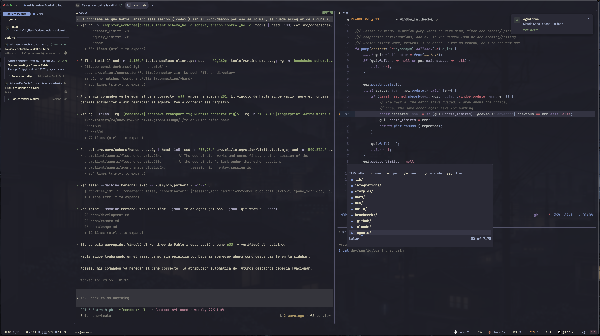
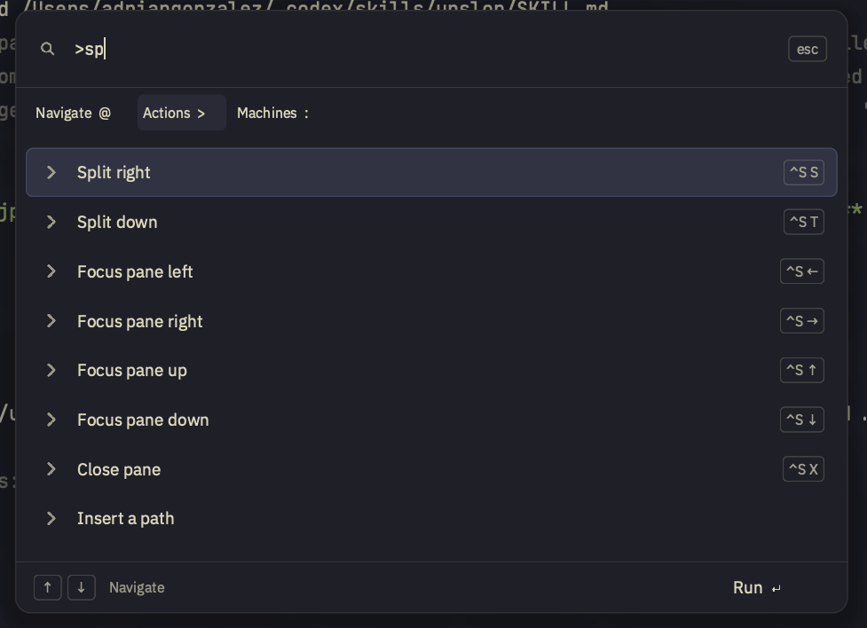
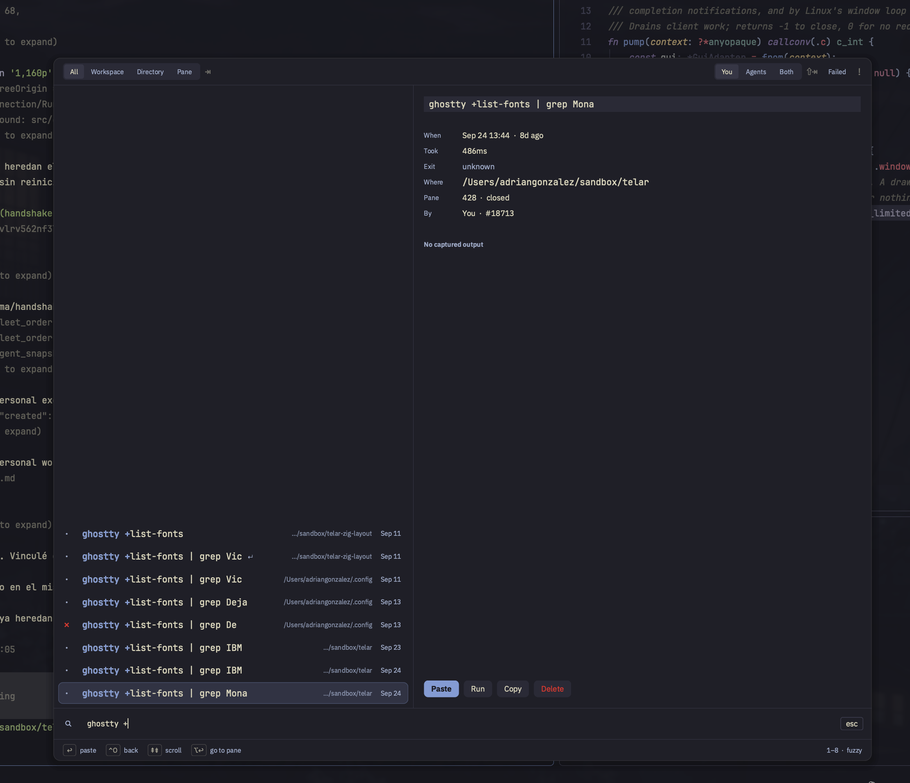

# Using Telar

This guide takes you from a source build to a workspace with two terminals,
then shows how to reconnect and find earlier commands.

## Build and open the window

There are no published releases yet. Follow the [README build steps](../README.md#getting-started)
and [platform dependencies](development.md#build-requirements). From the checkout:

```sh
./zig-out/bin/telar
```

A native window opens with your shell. The local runtime starts automatically
when needed. On Linux the window needs a Wayland desktop and a supported Vulkan
device. An SSH login or a build made with `-Dgui=false` can run the runtime and
CLI, but cannot open this window. See [remote machines](remote.md).

## Put Telar on your PATH

For the current shell, from the checkout:

```sh
export PATH="$PWD/zig-out/bin:$PATH"
telar --version
```

This changes only that shell and its children. For a persistent command, use
an installation location you will keep, then link its executable:

```sh
./zig-out/bin/telar cli install --dir "$HOME/.local/bin"
./zig-out/bin/telar cli status --dir "$HOME/.local/bin"
```

Add `~/.local/bin` to your shell's PATH if it is absent. This is a symlink to
the build, not a copy: moving or deleting the checkout breaks it. A regular
file already named `telar` is left untouched. For a macOS app or a Linux desktop
installation, use the [local installation guide](packaging.md#install-a-local-build).
Keep `telar-diagram-renderer` next to the executable.

## Workspaces, tabs and panes

A **workspace** groups work in a directory. A **tab** belongs to a workspace
and contains one or more **panes**. Each terminal pane runs its own shell or
command. A Git worktree gives a task a separate checkout and workspace; an
ordinary workspace does not require Git.



The sidebar shows agent activity while the panes hold the running programs.
This screenshot uses a customized configuration; the shortcuts below are the
defaults.

The default prefix is `Ctrl+b`. Press and release it, then type the suffix.
Uppercase suffixes need Shift. Escape cancels the prefix without running an
action. These are the defaults; [custom bindings](configuration.md#change-shortcuts)
can replace them.

| Suffix after `Ctrl+b` | Result |
| --- | --- |
| `%` / `"` | Split into left/right or top/bottom panes |
| Arrow key | Focus the adjacent pane |
| Shift + arrow key | Resize a split |
| `z` | Toggle the focused pane fullscreen |
| `c` | Create a tab |
| `n` / `p` | Select the next or previous tab |
| `T` | Rename the tab |
| `N` / `W` | Create a workspace / rename the workspace |
| `s` | Show or hide the agent sidebar |
| `g` | Open the goto picker |
| `x` / `X` | Close the pane / close the tab and its panes |
| `d` | Detach the client |

Try a split: run `pwd` in the first pane, press `Ctrl+b` then `%`, and run
`pwd` in the new pane. Use `Ctrl+b` then Left or Right to move between them.
Type in each to check which one has focus. Press `Ctrl+b` then `T` to give the
tab a name you can recognize later.

Closing a pane or tab closes its processes. To leave work running, detach or
close the window instead.

## Find an action

Press `Ctrl+b`, then `g` to open the command palette. Select **Actions** and
type `split` to find the split commands. Use Up/Down to select a result and
Enter to run it; Escape closes the palette.



The shortcuts beside each action reflect your active keybindings. The screenshot
uses a custom prefix, so those labels differ from this guide's defaults.

Choose **Navigate** to find workspaces, tabs and agents, or **Machines** to
switch to a configured machine. The search field also accepts mode prefixes:
`@` for navigation, `>` for actions and `:` for machines. For example, replace
the field's contents with `>split` to search actions directly.
See [remote machines](remote.md) to configure an SSH destination.

## Leave and return

A window is a client of the runtime. Closing it leaves the runtime's processes
running. Open `telar` again under the same account to reconnect to that runtime.
This does not mean processes survive shutting down the computer or stopping
the runtime. Session restoration can relaunch shells and resumable agents;
it cannot restore arbitrary running programs at their previous instruction.

`telar server stop` stops the runtime and its children. Finish or save their
work before using it. A window restart is enough to reconnect; do not stop the
server just to reopen the UI.

## Find previous commands

Press `Ctrl+b` then `/`. Type part of a command, select a result with the arrow
keys, and press Enter to paste it into the focused terminal. **By default this
does not execute it.** Shift+Enter executes the selected command. The
`client.history.enter` setting can reverse these two actions.

Tab changes scope between global, workspace, directory and pane. Shift+Tab
changes the author filter between your commands, agents' commands and both.
The initial view shows your commands unless configured otherwise. Ctrl+O opens
the selected command's details and available captured output; Escape goes back.
A leading `!` in the search asks for failed commands.



The selected result shows when and where it ran, its recorded duration, exit
status and author. This entry has no captured output; output is available only
for commands whose output Telar recorded.

The same history is available from the CLI:

```sh
telar history list --limit 10
telar history search "git" --cwd
telar history list --failed --author agent
```

Import an existing shell history explicitly if you want it included:

```sh
telar history import zsh --file "$HOME/.zsh_history"
```

Use `bash` or `fish` for their respective formats and file paths. Imported
commands do not acquire old output that was never captured. Shell detection
and agent hooks determine what Telar records; history is not a complete audit
log. Agent commands require the relevant [integration](agents.md).

## Troubleshooting

| Symptom | Check |
| --- | --- |
| `telar: command not found` | Run the build by its full path, then check PATH and the symlink above. |
| No window opens | Confirm the GUI was built and the desktop meets [platform requirements](development.md#build-requirements). A headless build cannot display a window. |
| A prefix shortcut does nothing | Press and release the prefix first. Check `client.prefix` and conflicting [custom bindings](configuration.md#change-shortcuts). |
| An app launched from Finder cannot find an agent or editor | Put PATH settings in your login-shell configuration. See [launcher environment](packaging.md#the-login-shell). |
| Changes to the config are rejected or ignored | Follow [configuration troubleshooting](configuration.md#check-and-reload). |
| An agent is missing or shows the wrong state | Follow [agent troubleshooting](agents.md#troubleshooting). |

`telar runtime status --json` checks whether a runtime is reachable without
starting one. `telar diagnostics logs --component runtime --lines 50` reads
available runtime logs; a missing log is not evidence that the runtime is
healthy. Include the error, OS, Git commit and reproduction steps in a report.
