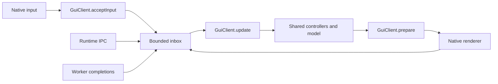

# Client state and pane storage refactor

Branch: `refactor/client-world-storage`. Baseline: `7877df05`.
Measured locally on 2026-09-21, Apple M3, aarch64 macOS, Zig 0.16.0.

## Code to review

- [`GuiClient`](../../../src/gui/GuiClient.zig): the native owner now admits input
  and consumes its inbox directly. `NativeLoop.drain` and `entrypoints/events`
  no longer forward the same state through two intermediate calls.
- [`MultiplexerModel`](../../../src/client/workspace/MultiplexerModel.zig): each
  tab holds 64 nullable pane pointers and the existing ID index. A live record
  is allocated when membership is established and destroyed on removal.
- [`Pane`](../../../src/client/panes/Pane.zig): the composer and review summary
  live inside that record. They no longer require separate allocations.
- All other pane traversal uses `paneIterator` or `paneConstIterator`. The
  read iterator returns const pointers and preserves slot order.

The existing roots remain meaningful: the runtime owns durable session state;
`AttachedClient.model` owns disposable shared-client state; `Application` and
`GuiClient` own the native window's renderer, input and host resources. A second
struct named `Telar` would duplicate that ownership hierarchy. Existing host
ports stay at the shared-client/native/TUI boundaries; the refactor removes
internal forwarding calls, not the adapter contracts.



The presentation message calls `GuiClient.complete`. Preparation and delivery
remain distinct: only successful delivery retires captured damage, and the cell
ACK still belongs to frame application. A synchronous `draw` that releases its
storage on return would violate the asynchronous GPU contract.

## Ownership, bounds and failure

The pane directory occupies 512 bytes per tab on this target, replacing 28,672
bytes of inline optional records. Capacity stays at 64 panes per tab and 64 tabs
per workspace. The existing bounded layout and ID index remain inline.

Creating a pane allocates its record and its variable buffers before publishing
membership. Failure releases partial allocations without changing existing
panes, layout or drafts. Removing a pane frees the record with its original
allocator. Tab moves preserve the addresses of surviving panes and their
composer fields. A pointer expires when its pane is removed; workers must still
use IDs and generations, never retained pane pointers.

Input, iteration, lookup and presentation capture add no steady-state
allocations. Large thread snapshots, history, images and terminal metadata keep
their existing ownership and quotas. Neither IPC encoding nor runtime authority
changes. On reconnect the client reconstructs membership from runtime snapshots.

This is a change to state ownership and allocation layout, not a conversion of
all pane fields to SoA. It trades inline capacity for one record pointer per
live pane. It does not demonstrate fewer cache misses. A columnar store for a
particular scan needs its own profile and comparison before introducing it.

## Memory measurements

`zig build bench -- --storage` reports `@sizeOf` and requested live bytes through
an accounting allocator. It does not measure RSS, malloc size classes, GPU
memory or the complete runtime. Each live-storage fixture owns one tab model
with 1x1 terminal cells and no thread history or images.

| Fixed structure | Before, bytes | After, bytes |
| --- | ---: | ---: |
| AttachedClient | 3,973,024 | 2,170,784 |
| Model | 2,720,544 | 918,304 |
| TabsModel | 2,337,384 | 535,144 |
| Tab | 36,400 | 8,240 |
| MultiplexerModel | 36,184 | 8,024 |
| Pane record | 440 | 4,712 |

The larger live Pane includes 4,288 bytes previously allocated separately and
removes their two pointers. Total fixed `AttachedClient` storage decreases by
1,802,240 bytes, 45.4%. These nested structures must not be added together.

| Live panes in one tab | Before bytes | After bytes | Before allocations | After allocations |
| --- | ---: | ---: | ---: | ---: |
| 0 | 36,184 | 8,024 | 1 | 1 |
| 1 | 128,096 | 100,360 | 7 | 6 |
| 8 | 771,480 | 746,712 | 49 | 41 |
| 64 | 5,918,552 | 5,917,528 | 385 | 321 |

Allocation counts include the model itself. Each live pane needs five allocations
instead of six. Sparse tabs benefit most; a full tab's payload barely shrinks.
Raw measurements: [before](before-storage.jsonl), [after](after-storage.jsonl).

## Validation

Build and codestyle checks passed. The final suites passed **2,319 tests**:
982 shared-client, 593 frontend and 744 GUI. The module/capability checker and
its 19 Python tests also passed. [Check summary](checks.txt).

The shared-client, frontend and GUI suites cover rendering, input, reconnect,
review state, presentation completion and retained resources. New checks inject
failure at every pane construction allocation, preserve drafts on rollback,
verify the capacity limit, reuse holes, keep addresses across tab reordering,
and reject allocation during iteration and presentation capture.

The native test used `tools/gui_review_availability.py`, the built Telar binary,
an isolated runtime and a fake agent. Eight states cover empty panes, one edit,
three panes, fullscreen, restoration and reconnect. The review action counts
match all expectations. No model API calls were made; the test's windows and
runtime were closed. [Recorded result](native-review.json).

Reproduce:

```sh
zig build -j2
zig build test-client test-gui test-frontend codestyle -j2 --summary all
zig build check-client-boundaries -j2
zig build bench -j2 -- --storage
zig build bench -j2 -- --filter frontend.multiplexer --samples 40 --json
python3 tools/gui_review_availability.py zig-out/bin/telar /private/tmp/telar-world-review-new
```

## Timing scope

The baseline executable was compiled before changing production code, with only
the `--storage` measurement option added. Both benchmark executables use
ReleaseFast. Each run contains 40 samples targeting 40 ms per sample. Reported
quantiles describe batch-average ns/op, not individual keystroke latency.

Three paired runs alternate before/after order, with builds, test suites and the
native fixture finished. Each cell below is the median of the three reported
quantiles, in ns/op. Individual runs remain in `multiplexer-1-*` through
`multiplexer-3-*`; [summary](timing-summary.json).

| Workload | p50 before | p50 after | p95 before | p95 after | p99 before | p99 after |
| --- | ---: | ---: | ---: | ---: | ---: | ---: |
| compose_four | 42,688 | 42,971 | 43,064 | 43,325 | 44,489 | 43,505 |
| patch_one_cell | 185 | 185 | 192 | 197 | 201 | 203 |

Four-pane composition's median rises by 283 ns, about 0.7%. The one-cell patch
median is unchanged; its p95 rises from 192 to 197 ns and p99 from 201 to 203 ns.
The result supports the memory reduction, not a CPU speedup or a cache-hit claim.
Tail samples vary: the first baseline patch run has a 463 ns p99, so the raw
runs matter more than a single summary number. Earlier smoke runs are retained
as `before-latency.jsonl` and `after-latency.jsonl` but do not define this table.

The baseline chrome workload exits with SIGSEGV during `TabsModel.init` before
producing a sample. LLDB recorded `EXC_BAD_ACCESS` at that initialization; see
[diagnostic](before-chrome-crash.txt). The refactored executable completes the
1, 8 and 64-tab workloads: [results](after-chrome.jsonl). There is no valid
before/after speed comparison for chrome and no claim that every stack issue is
fixed. The initialization-in-place APIs remain in use.

Wire bytes, queue depth and dropped work are not measured by these microbenchmarks.
The flow tests cover their contracts; this report is not an end-to-end latency
or multi-day soak result.
