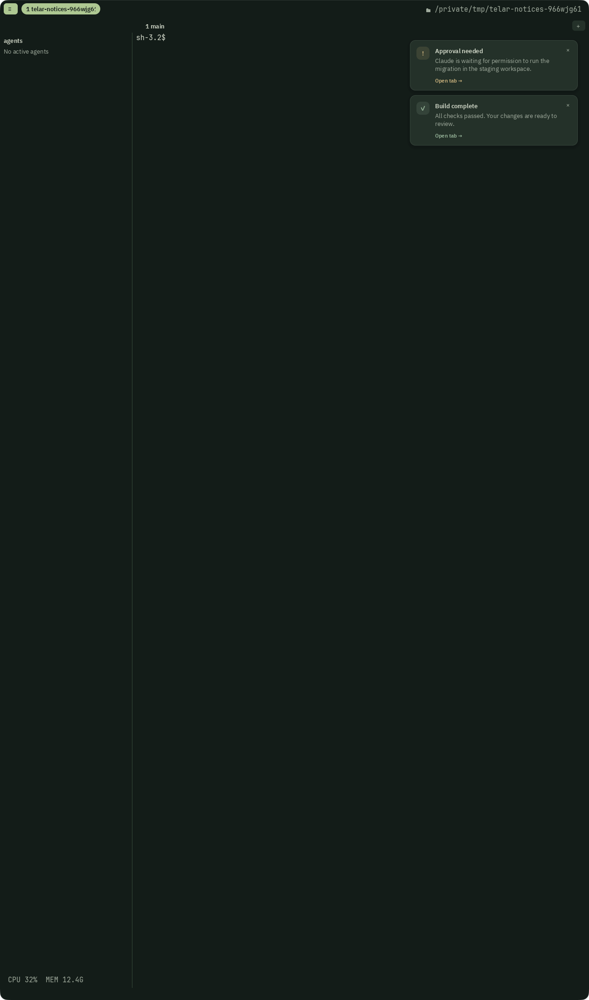

# Native notification cards

Validated on macOS on 2026-09-15.

## Automated checks

- `zig build test-gui`: 323 tests passed, including five new notification tests.
- `zig build test-client`: 901 tests passed.
- `zig build check-client-boundaries codestyle`: passed.
- `zig build`: passed and rebuilt the native application.
- `git diff --check` and formatting checks on the changed notification files:
  passed.

The notification tests exercise fractional pixel boundaries, late and rejected
frames, fixed card width during fades, stack repositioning, hidden-state
retirement, UTF-8 wrapping and ellipsis ownership, warm allocation bounds and
GUI lifecycle deadlines. Existing overlay tests now route notification input
through the delivered native widget registry, covering replacement identity,
close-button precedence, release capture and modal isolation.

## Native window

The existing `tools/gui_actions.m` driver and `gui_multiplexer.exercise` ran the
rebuilt binary against an isolated runtime. Two real CLI notifications targeted
tab 1 with a 20-second duration. Their messages exceeded one display line.
The driver captured the window, clicked the newest card's close control, waited
for its exit, and captured the surviving card in its new position.

[After dismissing the warning](after-dismiss.png), the success card occupies
the first position and the terminal remains available.

These captures exercise AppKit input and Metal presentation. Wayland/Vulkan
was not exercised in this validation.
