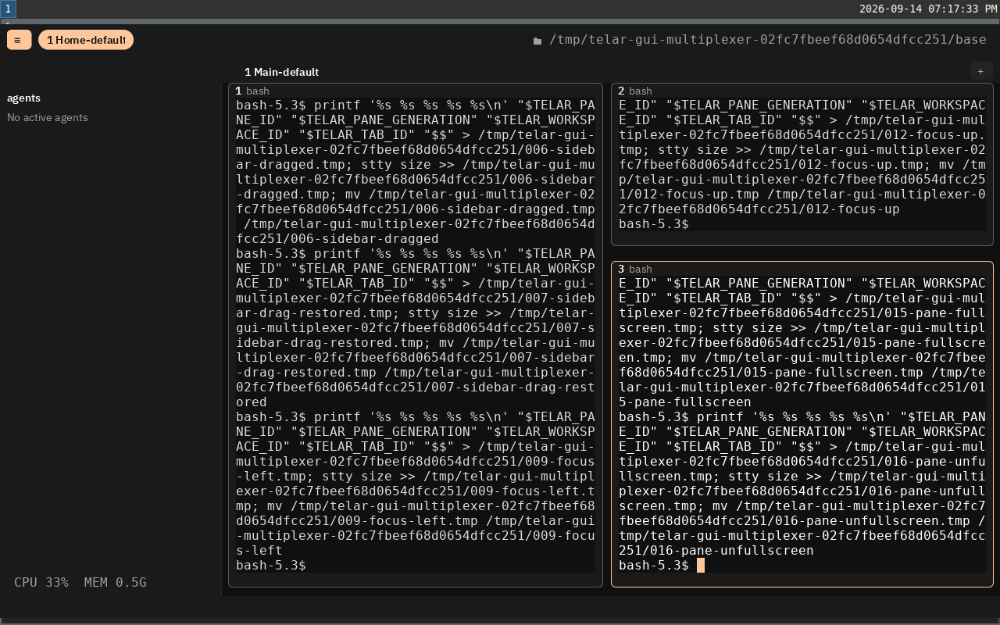
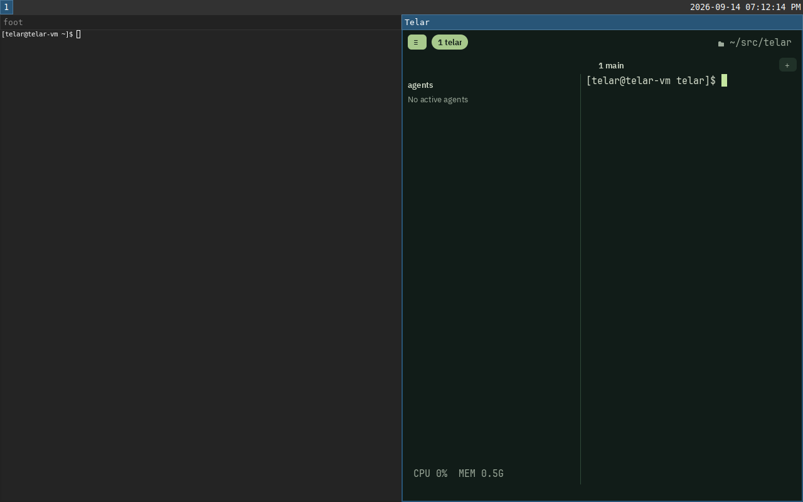

# Zig widgets and host input validation

Validated on 2026-09-14 with Zig 0.16.0 on macOS and the existing Fedora
Wayland VM. The VM uses software Vulkan, so these results establish behavior
and resource lifetime, not GPU performance on Linux hardware.

The implementation connects concrete Zig widgets, pixel layout, `Canvas`,
animation deadlines and a delivered-target dispatcher to the existing client
model. Platform adapters translate text input, clipboard requests, scrolling
and accessibility. Widgets execute application commands in Zig. The quad
frame and Metal/Vulkan drawing protocols remain unchanged.

The [complete widget composition report](composition.md) covers the subsequent
integration that makes the whole GUI frame pass through one widget list.

| Check | Result | Evidence |
| --- | --- | --- |
| macOS GUI, source style, client boundaries | 314 tests passed; all build steps passed | [GUI log](macos-gui.log) |
| Shared client | 901 tests passed | [Client log](client.log) |
| Terminal frontend | 607 tests passed | [Frontend log](frontend.log) |
| Linux executable, GUI and shared client | 313 GUI tests passed, one macOS-only optical-weight test skipped; 901 client tests passed | [Linux GUI log](linux-gui.log) |
| macOS native window with `MTL_DEBUG_LAYER=1` | No failures | [Window log](macos-window.log) |
| Linux native window with Vulkan validation | No failures; failed scene cleanup passed | [Window log](linux-window.log) |
| Linux IME, clipboard reader, keyboard, pointer, ATK and AT-SPI D-Bus | 29/29 build steps passed | [Host log](linux-host.log) |
| Linux multiplexer through the real window, default and custom bindings | Both complete runs passed; Vulkan core and synchronization validation clean | [Run log](linux-e2e.log), [default results](default-results.json), [custom results](configured-results.json) |

The GUI tests exercise real prompt fields and application handlers. They cover
physical key ownership across focus/modal changes, stale geometry and generations,
UTF-8 replacement boundaries, provisional composition and caret position,
asynchronous clipboard results, atomic paste overflow, and cuts that wait for a
successful native write without overwriting an intervening edit. Accessibility
range edits require the expected text revision. Animation tests cover deadlines,
retargeting, late frames and parking while presentation is in flight.

Native tests also cover UTF-8/UTF-16 conversion, backward selection, composition
cancellation within the same field, snapshots delayed by queued input, clipboard
failure and closure, partial pipe reads, and continuous scroll phases. AT-SPI
tests discover objects and invoke text/actions through a real isolated D-Bus
session. Retirement tests query the tree during synchronous defunct notifications.
Backpressure tests retain work without polling or blocking the window thread.

The window runs exercise sidebar keyboard controls and a QEMU tablet drag,
splits, directional focus, resize, fullscreen, tab creation and reordering,
workspace forms, navigation and closure. Detaching and reconnecting preserves
five shell PIDs, pane generations, workspaces, tabs and split sizes in each run.
The pointer driver uses the configured sidebar pixel edge and checks the output
scale and content origin before injecting coordinates.



The [default reconnection](default-07-reattached.png) and
[custom-binding reconnection](configured-07-reattached.png) are captured as well.
Native logs are retained for the [default launch](default-gui.log),
[default reconnection](default-reattach.log), [custom launch](configured-gui.log)
and [custom reconnection](configured-reattach.log).

The Linux GUI also opened successfully through the login-shell path:



## Reproduction

```sh
zig build test-gui test-client test-frontend codestyle check-client-boundaries --summary all
MTL_DEBUG_LAYER=1 zig build test-gui-window --summary all
python3 tools/vm/vm.py build install test-gui test-client --summary all
python3 tools/vm/vm.py build test-gui-ime test-gui-clipboard-reader test-gui-keyboard test-gui-pointer test-gui-accessibility test-gui-accessibility-bus --summary all
python3 tools/vm/vm.py exec env WAYLAND_DISPLAY=wayland-1 XDG_RUNTIME_DIR=/run/user/1000 VK_INSTANCE_LAYERS=VK_LAYER_KHRONOS_validation zig build test-gui-window --summary all
python3 tools/vm/gui-multiplexer-test.py /tmp/telar-widgets-e2e --skip-build --mode both
```

Invalid-configuration warnings in the GUI logs are expected test inputs; the
process exit codes and final build summaries show success.

## Limits

IME is tested through native client methods and controlled Wayland protocol
listeners. This run does not establish compatibility with every real IME engine
or screen reader. Wayland requires compositor support for text-input-v3 and
accepts surrounding text up to its protocol limit. Contexts that cannot be
represented safely disable that capability while ordinary keyboard input remains.

AppKit materializes a clipboard string before its size can be checked. Telar
bounds the admitted payload to 64 KiB, rather than AppKit's internal allocation.
Wayland reads retain at most 64 KiB and spend at most 16 read attempts or 16 KiB
per dispatch, under the original five-second deadline.

Frames still clear and draw the complete GPU target when a frame is needed.
This work preserves cell/glyph caches and idle pacing; it adds no partial GPU
damage renderer. See the [contributor contract](../../../src/gui/widgets/README.md)
and [native input flow](../../flows/native-input.md).
