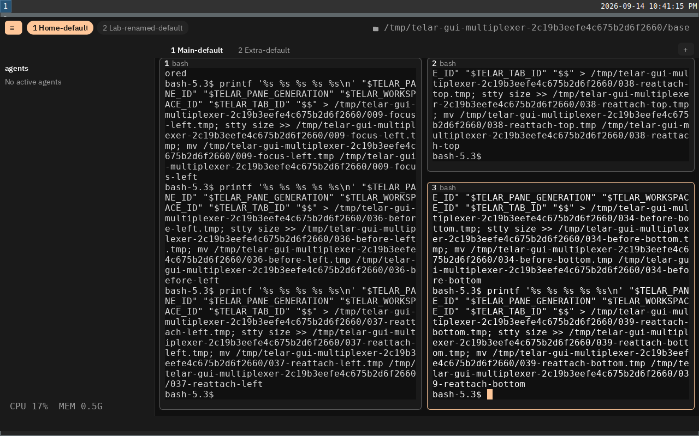

# Complete GUI widget composition

The foundation is recorded in commit `7b22fb59`. The subsequent integration
moves the full GUI frame through `Composition.render(&projection)` and one
`widgets.draw(&canvas)` call in `Scene.prepare`.

Composition selects terminal leaves, thread views, link decoration, five chrome
sections, focus, notification cards and one concrete modal. It emits no quads.
The bounded list has 74 slots, including the maximum 64 panes and every optional
layer. Terminal drawing retains its cell meshes, shaping cache and cursor order.
Notification cards retain their pixel layout, animation and clipped controls.

The composition and projection remain borrowed until drawing returns. Only
quads, atlas/page storage and owned control records survive to native delivery.
Drawing or registration failure leaves the previous delivered controls and
pending model damage intact. The frame and its maps are sealed after all
fallible drawing and registration have succeeded.

## Regression coverage

The tests in `src/gui/tests/widget_composition.zig` exercise the real client and
renderer rather than a mock widget loop:

- Compose a terminal, a thread, a link, permanent chrome, a notice and a modal;
  inspect their order and verify there are no quads before `draw`.
- Draw the selected widgets, then close the modal and blink the terminal cursor
  without reshaping text or repainting retained cells.
- Compose all 64 panes with every optional layer, draw the list, and reject an
  additional widget without losing its existing entries.
- Replace the model's prompt and receive newer pane output while a frame is in
  flight; verify quads and control records remain valid until its completion.
- Fail drawing after one quad, preserve the previous delivered editor and hit
  maps, retain pane damage, and successfully retry the complete frame.

The existing composition-budget tests continue to cover warm allocation-free
drawing, zero shaping work and cached terminal cells across GUI scenes.

## Validation

Run on 2026-09-15 with Zig 0.16.0 on macOS and the Fedora Wayland VM. Linux uses
software Vulkan; these are behavior and lifetime checks, not a hardware GPU
performance comparison.

| Check | Result | Evidence |
| --- | --- | --- |
| macOS GUI, source style and client boundaries | 323/323 tests; 25/25 build steps | [GUI log](composition-macos-gui.log) |
| Shared client and terminal frontend | 901 client tests and 607 frontend tests passed | [Shared log](composition-shared.log) |
| macOS native window with Metal validation | No failures | [Window log](composition-macos-window.log) |
| Linux executable and GUI tests | 322 passed; one macOS-only test skipped | [GUI log](composition-linux-gui.log) |
| Linux native window with Vulkan core and synchronization validation | No failures; rejected-frame cleanup passed | [Window log](composition-linux-window.log) |
| Linux multiplexer through the real window, default bindings | All seven checkpoints passed; no Vulkan validation errors | [Run log](composition-linux-e2e.log), [results](composition-e2e-results.json) |

The Linux run exercises pixel sidebar dragging, splits, focus, resizing,
fullscreen, tabs, workspace forms and detach/reconnect. Five shell processes,
their pane generations and split sizes survive reconnection. Both the
[initial native log](composition-e2e-gui.log) and
[reconnection log](composition-e2e-reattach.log) are empty. The final source
[comparison](composition-source-comparison.json) found no changes during the
Linux validation.



```sh
zig build test-gui codestyle check-client-boundaries --summary all
zig build test-client test-frontend --summary all
MTL_DEBUG_LAYER=1 zig build test-gui-window --summary all
python3 tools/vm/vm.py build install test-gui --summary all
python3 tools/vm/vm.py exec env WAYLAND_DISPLAY=wayland-1 XDG_RUNTIME_DIR=/run/user/1000 VK_INSTANCE_LAYERS=VK_LAYER_KHRONOS_validation VK_LAYER_VALIDATE_SYNC=1 zig build test-gui-window --summary all
python3 tools/vm/gui-multiplexer-test.py /tmp/telar-widget-scene-linux-e2e --skip-build --mode default
```

The [widget guide](../../../src/gui/widgets/README.md) describes the contributor
API. The [foundation report](README.md) records the input, IME, clipboard and
accessibility coverage and its platform limits.
