# Zig GUI composition

The GUI builds concrete Zig widgets during synchronous preparation of a client
`Projection`. Each widget draws through `Canvas`. Metal and Vulkan consume only
the sealed quad frame, glyph atlas and sprite page; adding a widget does not add
a native drawing callback or a GPU command type.

`Scene.prepare` starts the frame resources, then calls `Composition.render` with
the borrowed projection. That method returns the complete `frame_widget.List`:
terminal leaves, thread views, a hovered link, top bar, status bar, sidebar,
pane decorations, chrome focus, notifications and the selected modal. It emits
no quads. `Scene` draws the list once through `draw(canvas)` and seals the frame
and its control registries only after drawing and registration succeed.

```zig
var composition: Composition = .{
    .chrome = chrome,
    .overlays = overlays,
    .canvas = &canvas,
};
const widgets = try composition.render(&projection);
try widgets.draw(&canvas);
```

`Composition` owns the context borrowed by chrome widgets. Keep it and the
projection at stable addresses until drawing returns; returning the list does
not extend either lifetime. The list holds at most 73 widgets, derived from the
64-pane limit, one link, four chrome sections, one focus indicator, two notices
and one modal. A frame can contain both terminal and thread leaves. Its commit
captures the generations and damage of the panes actually composed.

`frame_widget.zig` declares the frame's tagged union. Add a variant and select it
in `Composition.render` to introduce a new frame section. Containers may build
their own concrete widget lists. `Surface`, `Text` and `Sprite` are reusable
leaves. `Chrome.paint` and `Overlays.paint` remain standalone entrypoints for
isolated rendering tests; both use their composition and widget draw methods.
`TopBar` composes the workspace controls and `TabStrip` in one navigation row;
tabs are no longer a separate frame section. `StatusBar` owns configured bottom
widgets and mode hints, with space reserved for TLS in every mode.

```mermaid
flowchart LR
    OS[Operating system] --> Host[Native input adapter]
    Host --> Queue[Owned input queue]
    Queue --> Dispatch[Zig widget dispatcher]
    Dispatch --> Commands[Shared application commands]
    Commands --> Model[Client model]
    Model --> Projection
    Projection --> Composition[Composition.render]
    Clock[Animation deadlines] --> Composition
    Composition --> List[Frame widget list]
    List --> Draw[Each widget.draw]
    Draw --> Canvas
    Canvas --> Frame[Quads and resource references]
    Frame --> GPU[Metal or Vulkan]
    GPU --> Completion[Presentation completion]
    Completion --> Registry[Delivered widget targets]
    Registry --> Dispatch
```



## Layout and drawing

`layout/Layout.zig` resolves caller-owned `Item` arrays in device pixels. A child
uses fixed, measured-content or fill sizes, with minimum and maximum bounds.
Containers provide rows, columns, overlays, padding, gaps and alignment. Nest a
container by resolving another array inside its parent's assigned rectangle.
Chrome logical dimensions are converted through `ChromeMetrics.px` first.

`TerminalPane.draw` uses `Canvas.terminal` to paint canonical cells and the cursor
through the existing retained cell cache. Terminal shaping, selection colors and
cursor ordering stay in that specialized painter. Selecting terminal leaves is
the composition's job; the GUI no longer calls `TerminalRenderer.prepare` to
paint them before its widget list.

```zig
var rows = [_]LayoutItem{
    .{ .height = .{ .fixed = 24 } },
    .{},
};
try (Layout{
    .area = bounds,
    .direction = .column,
    .padding = .{ .left = 8, .right = 8 },
    .gap = 6,
}).resolve(&rows);

const WidgetList = GenericWidgetList(Widget, 16);
var widgets: WidgetList = .{};
try widgets.append(.{ .surface = .{
    .bounds = rows[0].bounds,
    .fill = .{ .color = palette.surface0, .radius = 4 },
} });
try widgets.draw(canvas);
```

`Widget` is the composition's tagged union; its `draw` dispatches to each
variant's `draw(canvas)`. The list owns the struct values, not copies of their
borrowed strings or pointers. Measure labels through `Canvas.measure` and supply
the result as the item's intrinsic size. A container owns clipping for both its
drawing and its hit regions. The list itself does not clip or scroll. Minimums
may overflow a small container; fixed/content items do not shrink implicitly.
Fill items receive equal shares above their minimums, capped by their maximums;
remaining excess space participates in alignment.

## Input and host services

`input/event.zig` defines committed text, paste, key phases, pointer gestures,
precise two-axis scroll, focus, IME composition, clipboard completions and
accessibility actions. Only `native/decode_input.zig` interprets numeric C ABI
tags. `NativeInput` copies borrowed payloads into bounded storage before native
callbacks return. The window thread drains them through `GuiClient.widgetInput`
before the terminal router. Terminal input keeps its physical-key and pane
ownership rules.

`Canvas.widgets` exposes the client's interaction state during drawing. Register
a `Target` with the rectangle actually painted, an owned semantic action, a
label, role and focus policy. `Dispatcher` retains the last successfully delivered
registry. It chooses focus, hover and per-button capture from that registry;
physical key leases prevent repeats and releases from changing owner. A modal
restricts new input to its layer. Tab traversal applies while a widget owns focus
or a modal is active, unless the target disables `traverse_tab`. `TextField`
disables it so shared handlers retain completion and form navigation. Terminal
Tab retains its existing behavior.

For targets without an explicit ID, the dispatcher reuses identity across
delivered frames by matching namespace, action and generation. Give controls with
the same action distinct namespaces. A changed generation or disappearance
retires the previous identity.

The permanent chrome registers its existing semantic actions. `TextField` paints
the prompt's committed selection and the client's provisional IME composition.
Editing becomes commands to the shared prompt handlers. Widget lists remain
transient Zig values; the dispatcher stores identifiers and copied actions, never
pointers to those values. A new application action is handled in Zig in
`widgets/interaction/routing.zig`.

The integrated editable state currently comes from `Prompt` through `FieldView`
and the shared prompt commands. An editor backed by another model needs its
state and commands connected in Zig; native adapters consume the same text
context contract.

A text widget supplies current UTF-8 surrounding text, selection byte offsets and
caret geometry. `widgetTextContext` exposes that state through a synchronous
snapshot. AppKit implements `NSTextInputClient`; Wayland implements
`text-input-v3` when the compositor advertises it. Platform adapters translate
native ranges and report provisional text, commits and cancellation. Zig owns
the selection and committed edits. Target ID plus generation rejects events for
retired editors. XKB compose remains the Linux fallback.

Use `requestClipboardRead(id, generation)` and `requestClipboardWrite(bytes)` for
asynchronous UTF-8 clipboard operations. `host/Services` owns requests and matches
their completions. A read cannot paste into a newly focused widget. Terminal paste
shortcuts also originate in Zig and capture the terminal attachment before the
read; delivery then follows the existing bounded pane paste path. Opening links
continues through the shared `LinkOpener` port. A cut uses an owned write request and deletes its
selection only after success while the captured editor revision still matches.

The delivered registry also publishes an accessibility tree with roles, labels,
values, focus, selection and supported actions for registered targets. It does
not expose the terminal's complete text contents. macOS exposes it through
`NSAccessibility`; Linux exposes it through ATK/AT-SPI. Native accessibility
actions return to the same Zig event queue. Partial text replacements include an
expected text revision, so delayed accessibility operations cannot overwrite
intervening edits. New widget semantics require no
Metal, Vulkan or platform-specific control implementation.

See [native input](../../../docs/flows/native-input.md) for limits, ownership and
host validation commands.

## Animation and invalidation

During scene preparation, `Canvas.animation` exposes a `FrameClock` with one
monotonic timestamp and one earliest requested deadline. A sprite can choose
`clock.step(interval_ns) % count`; a transition can use `clock.sample(transition)`.
`Transition.retarget` starts from the current value to avoid a discontinuity.
Transition state belongs to the client or widget owner, outside the transient
list. Attention rings demonstrate attachment-scoped ownership and retirement.

Each preparation resets the deadline requests and only visible widgets renew
them. Finished transitions request nothing. The GUI uses the host animation
clock instead of the model's TUI animation timer. The driver merges widget and
cursor deadlines, parks widget timers while a presentation is in flight or a
requested draw awaits the compositor, and resumes when preparation begins.
Late frames sample current time rather than
replaying intermediate states.

Local interaction advances the chrome or widget revision. Runtime/model revisions
continue through `LifecycleState`. Painting creates a complete frame; the GPU
still clears and draws the whole target. Cell meshes and glyph shaping are
cached, but this layer does not implement retained widget meshes, render-target
layers or partial GPU damage.

## Ownership, bounds and delivery

- The client owns layout, interaction and animation state. The runtime owns
  terminal contents and agent truth. Native callbacks only admit events; the
  window thread mutates GUI state.
- Widget lists have compile-time capacities and reject overflow. Layout uses
  caller-owned storage and linear passes without allocation. Measurements and
  lengths are validated before publishing any child bounds.
- Each registry holds at most 256 targets, including 16 editor geometries, with
  labels stored in 128-byte buffers. Provisional composition and a widget paste
  transaction each have a 4 KiB budget. Committed text also obeys its model's
  capacity: 128 bytes for the prompt field and 4096 for its directory field.
- Widgets and their projection are borrowed only until preparation returns.
  Stack-formatted strings must be drawn before their scope ends, or copied into
  frame-owned storage before appending a widget. Async consumers never retain
  a widget, `Canvas`, context or projection pointer.
- The renderer owns atlas/page memory and its existing quotas. Image decoding
  and external work stay on bounded media/observation workers. A widget draws a
  resource identifier rather than loading or decoding an image in `draw`.
- There is one presentation in flight. Its token publishes matching hit maps
  and retires only captured model damage on successful completion. Failed
  delivery preserves previously delivered controls; newer changes remain
  pending. See the [presentation contract](../../client/presentation/README.md).

`zig build test-gui` covers actual chrome composition, borrowed input ownership,
layout bounds, widget-list capacity/order, warm allocation-free drawing, delayed
presentation, gesture routing and animation deadlines. `zig build test-client
check-client-boundaries codestyle` checks shared client behavior and boundaries.
Run native window checks on each host when changing its bridge. On Linux also
run `test-gui-ime`, `test-gui-clipboard-reader`, `test-gui-keyboard` and
`test-gui-pointer`. These check protocol batching, UTF-8 ranges, backpressure,
physical ownership and fractional scroll independently of a running compositor.
