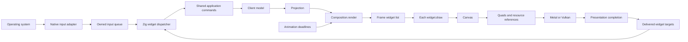

# Zig GUI composition

The GUI builds concrete Zig widgets during synchronous preparation of a client
`Projection`. Each widget draws through `Canvas`. Metal and Vulkan consume only
the sealed quad frame, glyph atlas and sprite page; adding a widget does not add
a native drawing callback or a GPU command type.

`Scene.prepare` starts the frame resources, then calls `Composition.render` with
the borrowed projection. That method returns the complete `frame_widget.List`:
terminal leaves, a hovered link, top bar, status bar, sidebar,
pane decorations, chrome focus, notifications and the selected modal. It emits
no quads. `Scene` draws the list once through `draw(canvas)` and seals the frame
and its control registries only after drawing and registration succeed.

```zig
var composition: Composition = .{
    .chrome = chrome,
    .overlays = overlays,
    .canvas = &canvas,
};
const widgets = try composition.render(&projection);
try widgets.draw(&canvas);
```

`Composition` owns the context borrowed by chrome widgets. Keep it and the
projection at stable addresses until drawing returns; returning the list does
not extend either lifetime. The list holds at most 78 widgets, derived from the
64-pane limit, one link, seven chrome sections, one focus indicator, two
notices, one modal and the image preview shelf and modal. Its commit captures the generations and damage of the panes
actually composed.

`frame_widget.zig` declares the frame's tagged union. Add a variant and select it
in `Composition.render` to introduce a new frame section. Containers may build
their own concrete widget lists. `Surface`, `Text` and `Sprite` are reusable
leaves. All GUI widgets and their drawing support live under `gui/widgets`;
modal and notification widgets live in its `overlays` subdirectory. `Canvas`
belongs here too. Every drawable component implements `draw(self, canvas)`;
its geometry and semantic inputs are fields on the widget value. A container
draws its children through that same method.

`Chrome` and `overlays/Overlays` own retained interaction state and compose
widget values. They have no drawing entrypoint. `SidebarState` retains scroll
and snapshot ordering; `Sidebar.draw` borrows it while drawing the actual
sidebar. Tests use the same compose, draw and seal steps as the scene.

`Sidebar` composes the project list above the agent cards. `SidebarRegions`
resolves both viewports once per preparation, and the delivered hit map owns
scroll targeting. `SidebarState` retains separate `PixelScroll` values;
`WorkspaceList` clips project rows and reveals the active runtime identity.
A collapsed sidebar draws `WorkspaceRail` in its band and `RailTooltip` above
the panes. `TopBar` names the current context beside the rail, or keeps the
toggle beside the expanded sidebar, and falls back to `WorkspaceIndicators`
only when neither can show the projects. `TabStrip` packs tabs from the left
and compresses them around the selection.
Tabs are not a separate frame section. `StatusBar` owns configured bottom
widgets and mode hints, with space reserved for TLS in every mode.


```mermaid
flowchart LR
    OS[Operating system] --> Host[Native input adapter]
    Host --> Queue[Owned input queue]
    Queue --> Dispatch[Zig widget dispatcher]
    Dispatch --> Commands[Shared application commands]
    Commands --> Model[Client model]
    Model --> Projection
    Projection --> Composition[Composition.render]
    Clock[Animation deadlines] --> Composition
    Composition --> List[Frame widget list]
    List --> Draw[Each widget.draw]
    Draw --> Canvas
    Canvas --> Frame[Quads and resource references]
    Frame --> GPU[Metal or Vulkan]
    GPU --> Completion[Presentation completion]
    Completion --> Registry[Delivered widget targets]
    Registry --> Dispatch
```

## Layout and drawing

The new-context form uses `overlays/WorkspaceFormLayout` and `DialogSurface`.
Its width, fields and folder rows follow chrome pixel metrics. The fields keep
their position while directory results arrive; at most four rows are visible,
with wheel/trackpad and arrow-key navigation. Small windows keep the active
editor and the form actions. Other modals still use their existing layouts.

`TextField.form_control` adds padding, rounded chrome and a thin caret. The
delivered editor geometry describes the inset text area at its own font size,
so pointer selection and native IME queries use the same coordinates. Context
buttons activate on release inside their delivered bounds. Folder targets carry
the prompt generation and listing revision; a stale click cannot accept a newer
result. The shared controllers continue to own completion and submission.
These controls use bounded frame storage and require no runtime UI state.

`layout/Layout.zig` resolves caller-owned `Item` arrays in device pixels. A child
uses fixed, measured-content or fill sizes, with minimum and maximum bounds.
Containers provide rows, columns, overlays, padding, gaps and alignment. Nest a
container by resolving another array inside its parent's assigned rectangle.
Chrome logical dimensions are converted through `ChromeMetrics.px` first.

`TerminalPane.draw` uses `Canvas.terminal` to paint canonical cells and the cursor
through the existing retained cell cache. Terminal shaping, selection colors and
cursor ordering stay in that specialized painter. Selecting terminal leaves is
the composition's job; the GUI no longer calls `TerminalRenderer.prepare` to
paint them before its widget list.

```zig
var rows = [_]LayoutItem{
    .{ .height = .{ .fixed = 24 } },
    .{},
};
try (Layout{
    .area = bounds,
    .direction = .column,
    .padding = .{ .left = 8, .right = 8 },
    .gap = 6,
}).resolve(&rows);

const WidgetList = GenericWidgetList(Widget, 16);
var widgets: WidgetList = .{};
try widgets.append(.{ .surface = .{
    .bounds = rows[0].bounds,
    .fill = .{ .color = palette.surface0, .radius = 4 },
} });
try widgets.draw(canvas);
```

`Widget` is the composition's tagged union; its `draw` dispatches to each
variant's `draw(canvas)`. The list owns the struct values, not copies of their
borrowed strings or pointers. Measure labels through `Canvas.measure` and supply
the result as the item's intrinsic size. A container owns clipping for both its
drawing and its hit regions. The list itself does not clip or scroll. Minimums
may overflow a small container; fixed/content items do not shrink implicitly.
Fill items receive equal shares above their minimums, capped by their maximums;
remaining excess space participates in alignment.

## Input and host services

`input/event.zig` defines committed text, paste, key phases, pointer gestures,
precise two-axis scroll, focus, IME composition, clipboard completions and
accessibility actions. Only `native/decode_input.zig` interprets numeric C ABI
tags. `InputQueue` copies borrowed payloads into bounded storage before native
callbacks return. The window thread drains them through `GuiAdapter.widgetInput`
before the terminal router. Terminal input keeps its physical-key and pane
ownership rules.

`Canvas.widgets` exposes the client's interaction state during drawing. Register
a `Target` with the rectangle actually painted, an owned semantic action, a
label, role and focus policy. `Dispatcher` retains the last successfully delivered
registry. It chooses focus, hover and per-button capture from that registry;
physical key leases prevent repeats and releases from changing owner. A modal
restricts new input to its layer. Tab traversal applies while a widget owns focus
or a modal is active. Terminal Tab retains its existing behavior.

For targets without an explicit ID, the dispatcher reuses identity across
delivered frames by matching namespace, action and generation. Give controls with
the same action distinct namespaces. A changed generation or disappearance
retires the previous identity.

A band hit's `BandPlacement` becomes its target's namespace, and the chrome's
hover compares it too, so two band controls with one intent in the same frame,
such as the top bar's machine segment and the sidebar's `+N`, keep separate
identity, hover and focus. A new band control that repeats an intent drawn
elsewhere in the frame needs its own placement.

The permanent chrome registers its existing semantic actions. `TextField` paints
the prompt's committed selection and the client's provisional IME composition.
Editing becomes commands to the shared prompt handlers. Widget lists remain
transient Zig values; the dispatcher stores identifiers and copied actions, never
pointers to those values. A new application action is handled in Zig in
`widgets/interaction/routing.zig`.

The integrated editable state currently comes from `Prompt` through `FieldView`
and the shared prompt commands. An editor backed by another model needs its
state and commands connected in Zig; native adapters consume the same text
context contract.

A text widget supplies current UTF-8 surrounding text, selection byte offsets and
caret geometry. `widgetTextContext` exposes that state through a synchronous
snapshot. AppKit implements `NSTextInputClient`; Wayland implements
`text-input-v3` when the compositor advertises it. Platform adapters translate
native ranges and report provisional text, commits and cancellation. Zig owns
the selection and committed edits. Target ID plus generation rejects events for
retired editors. XKB compose remains the Linux fallback.

Use `requestClipboardRead(id, generation)` and `requestClipboardWrite(bytes)` for
asynchronous UTF-8 clipboard operations. `host/Services` owns requests and matches
their completions. A read cannot paste into a newly focused widget. Terminal paste
shortcuts also originate in Zig and capture the terminal attachment before the
read; delivery then follows the existing bounded pane paste path. Opening links
continues through the shared `LinkOpener` port. A cut uses an owned write request and deletes its
selection only after success while the captured editor revision still matches.

The delivered registry also publishes an accessibility tree with roles, labels,
values, focus, selection and supported actions for registered targets. It does
not expose the terminal's complete text contents. macOS exposes it through
`NSAccessibility`; Linux exposes it through ATK/AT-SPI. Native accessibility
actions return to the same Zig event queue. Partial text replacements include an
expected text revision, so delayed accessibility operations cannot overwrite
intervening edits. New widget semantics require no
Metal, Vulkan or platform-specific control implementation.

See [native input](../../../docs/flows/native-input.md) for limits, ownership and
host validation commands.

## Command history

`HistoryModal` is a large panel above the status bar. `HistoryModalLayout`
sizes it from the window alone: up to 1360 logical pixels wide and 80% of the
window's height, never under 640 while the window allows it, so a larger
window shows more commands. The filter chips sit in its header, the commands
grow upward from the search field at its foot, where the shell prompt was,
with the newest right above the field under day headings
(`history_labels.dayLabel`), and the key hints close the panel. Commands and
captured output keep the terminal face; headings, chips and facts use the
chrome face. Replacing a page, moving the selection and opening the inspector
never move the field. From 900 logical pixels of panel the inspector takes
56% of the list's area beside it; a narrower panel lets it replace the list,
and one under 420 by 260 drops the header. `DialogSurface` dims the window at
0.25 and draws a 12 px radius with a hairline edge.

The command comes first. A `HistoryRow` is one line: a status glyph in the
meaning's color (failure red, running teal, interrupted yellow, success
quiet), the command with the match highlighted, and its facts only in the
space the command leaves: the directory goes first, then the time, and an
agent's provider mark survives last. Directory and pane scopes hide the
directory. Under a day heading the time is the local clock; while searching
it is the date. The page's `utc_offset_min`, read by the client when the
reply lands, turns timestamps into local days. Nothing is cut without a
mark: a line that does not fit ends in `…`, and a command that continues on
further lines in `↵`.

The selected row opens into a card with the complete command wrapped at
spaces (`WrappedLines.words`; a multi-line command keeps its lines), a facts
line (directory, outcome, duration, age, author) and the actions that only
make sense for a selection: copy, delete and go to pane. A card takes at
most ten lines and 45% of the list, so its neighbours stay in view; past
that it says how many lines remain and names the inspector's key. A capture
cut short, or a complete command still on its way, is said in the same
place. Rows paint `HistoryPaletteState.ownedCommand`, which a pending query
does not change, while pasting still goes through `commandAt`. The list
keeps two older rows in view above the selection while it scrolls. With the
inspector beside the list the selected row stays one line, since the
inspector shows the command.

The chips are the scope segmented control (`select_scope`), the author
control (`select_author`) and the failed toggle (`toggle_failed`); a leading
`!` in the field is the failed filter too. The footer keeps what every
selection can do (paste, run, details); `key_label.host_style` spells the
keys `⌃O` on macOS and `Ctrl+O` elsewhere. Footer and card hints are
`HistoryHint`s: a keycap as the command palette draws it, the word, and the
control its key triggers, so the pointer reaches everything the keys do. The
field's `esc` closes the panel, and the inspector adds a button row (paste,
run, copy, delete, go to pane). The row above the oldest command asks for
the previous page. A row click selects without submitting, and one wheel
step is a closed row. Rows and every submit control carry the delivered
history revision, so a replaced or pending page cannot run an unseen
command. The search field retains keyboard and IME focus.

The inspector walks `HistoryDetails.lines`: the wrapped command, its facts
(local time and age, duration, exit, directory, pane with its tab or
`closed`, author with provider and origin) and the captured output, stripped
of escape sequences when the reply landed (`core.plainText`). Painting and
the scroll bound count the same lines. Its metrics travel with `HitState`,
so failed presentations preserve the visible geometry's scroll bound.

## Path picker

`PathPicker` is a popover at the focused pane's cursor, not a dialog: it
does not dim the window, so the prompt it types into stays readable. It sits
under the cursor, or above it when the rows below do not fit
(`path_picker_placement`), and the search field is always the row next to
the cursor. Rows show a folder or file glyph from the embedded symbols face,
then the path laid out by `PathLabel`: directory in `subtext0`, file name in
`text`, matched characters in the accent, and the middle of a long directory
replaced by `…`. Directories use `blue`, never a status color. The footer
shows how many paths the index holds, or `indexing` while it grows, and the
host's key hints. Rows register in `PaletteHits`, so a press chooses one
exactly as the command palette's rows do.

## Animation and invalidation

Child progress uses `PaneProgress` capsules in pane headers and a compact ring
in the active tab for a single pane. Fullscreen keeps the indicator in the
bottom band, beside the leave control
(`FullscreenStrip`). Percentages ease between reports over 240 ms; unknown progress
uses a rotating arc sampled from the presentation clock at 60 Hz. Pause and
error have distinct marks and stop animation. Removing progress clears the
indicator immediately, since removal can also mean interruption.

`Chrome.progress` retains bounded `ProgressMotions` by pane ID and attachment
generation. Only painted indicators renew their entries and deadlines; hidden,
removed and reattached panes cannot inherit a previous animation. `ProgressRing`
uses at most 66 rounded quads with a precomputed circle, without font shaping,
texture uploads or frame-time allocation. The frame budget reserves space for
one capsule per visible pane. The runtime keeps its progress protocol.

History opens with a 220 ms cubic ease-out, fading in while moving up twelve
logical pixels. `Overlays` retains one `ModalMotion` keyed by prompt generation;
edits, query results and toggling details do not restart it. Painting and input
registration use the same shifted rectangles. Closing or finishing the entrance
leaves no animation deadline.

Moving the selection changes the model at once; `Overlays` retains one
`SelectionMotion` that opens the card of the row the selection reached over
140 ms while the one it left closes, so their neighbours barely move. The
highlight of the selected row is never delayed, and no glyph fades. A page
replaced under the same position does not replay the motion, so typing
never animates. The inspector fades in over the entrance's duration through
a second `ModalMotion`; its geometry does not move, so painting and input
agree on every frame.

While a replacement page is pending, the previous rows stay as they were.
`Overlays` retains one `LoadingCue`: only a wait longer than 150 ms dims the
rows and runs the loading line, so a reply that lands within a few frames
never flashes the panel on each keystroke. A new query while one is pending
continues the same wait, and a reply ends it. Rows and submit controls stay
disabled for the whole wait, visible or not.

During scene preparation, `Canvas.animation` exposes a `FrameClock` with one
monotonic timestamp and one earliest requested deadline. A sprite can choose
`clock.step(interval_ns) % count`; a transition can use `clock.sample(transition)`.
`Transition.retarget` starts from the current value to avoid a discontinuity.
Transition state belongs to the client or widget owner, outside the transient
list. Attention rings demonstrate attachment-scoped ownership and retirement.

Each preparation resets the deadline requests and only visible widgets renew
them. Finished transitions request nothing. The GUI uses the host animation
clock instead of the model's animation timer. The driver merges widget and
cursor deadlines, parks widget timers while a presentation is in flight or a
requested draw awaits the compositor, and resumes when preparation begins.
Late frames sample current time rather than
replaying intermediate states.

Local interaction advances the chrome or widget revision. Runtime/model revisions
continue through `LifecycleState`. Painting creates a complete frame; the GPU
still clears and draws the whole target. Cell meshes and glyph shaping are
cached, but this layer does not implement retained widget meshes, render-target
layers or partial GPU damage.

## Ownership, bounds and delivery

- The client owns layout, interaction and animation state. The runtime owns
  terminal contents and agent truth. Native callbacks only admit events; the
  window thread mutates GUI state.
- Widget lists have compile-time capacities and reject overflow. Layout uses
  caller-owned storage and linear passes without allocation. Measurements and
  lengths are validated before publishing any child bounds.
- Each registry holds at most 256 targets, including 16 editor geometries, with
  labels stored in 128-byte buffers. Provisional composition and a widget paste
  transaction each have a 4 KiB budget. Committed text also obeys its model's
  capacity: 128 bytes for the prompt field and 4096 for its directory field.
- Widgets and their projection are borrowed only until preparation returns.
  Stack-formatted strings must be drawn before their scope ends, or copied into
  frame-owned storage before appending a widget. Async consumers never retain
  a widget, `Canvas`, context or projection pointer.
- The renderer owns atlas/page memory and its existing quotas. Image decoding
  and external work stay on bounded media/observation workers. A widget draws a
  resource identifier rather than loading or decoding an image in `draw`.
- There is one presentation in flight. Its token publishes matching hit maps
  and retires only captured model damage on successful completion. Failed
  delivery preserves previously delivered controls; newer changes remain
  pending. See [presentation delivery](../../../docs/invariants.md#presentation-delivery).

`zig build test-gui` covers actual chrome composition, borrowed input ownership,
layout bounds, widget-list capacity/order, warm allocation-free drawing, delayed
presentation, gesture routing and animation deadlines. `zig build test-client
check-client-boundaries codestyle` checks shared client behavior and boundaries.
Run native window checks on each host when changing its bridge. On Linux also
run `test-gui-ime`, `test-gui-clipboard-reader`, `test-gui-keyboard` and
`test-gui-pointer`. These check protocol batching, UTF-8 ranges, backpressure,
physical ownership and fractional scroll independently of a running compositor.

## Diagrams

A widget that shows a Mermaid diagram asks `diagrams.Store` for it while
measuring, with an owner key it chooses, and draws the ready image through
`Canvas.diagramAt`. Rendering runs in `lib/mermaid` on an inbox worker; the
store keeps eight texture slots and pins visible ones until delivery. No widget
does this yet. See [Mermaid diagrams](../../../docs/flows/mermaid-diagrams.md).
