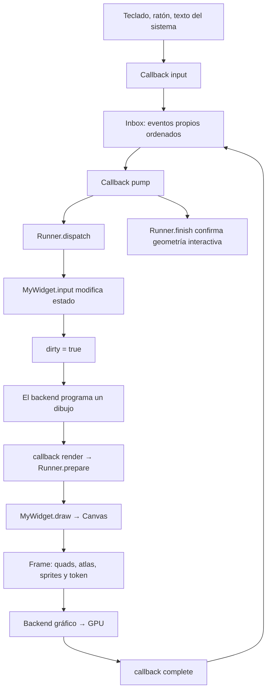
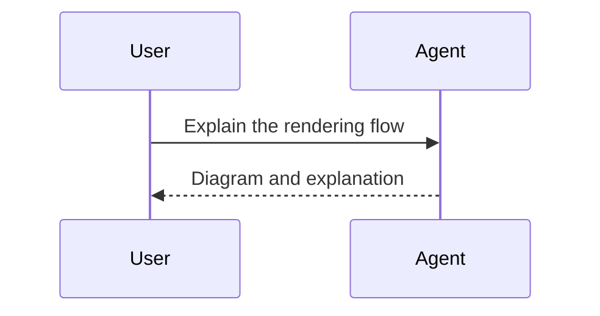

## Native diagram rendering

The message keeps its original Mermaid source when copied.

### One turn, two participants

The diagrams are generated locally and survive reconnect through the retained message.
